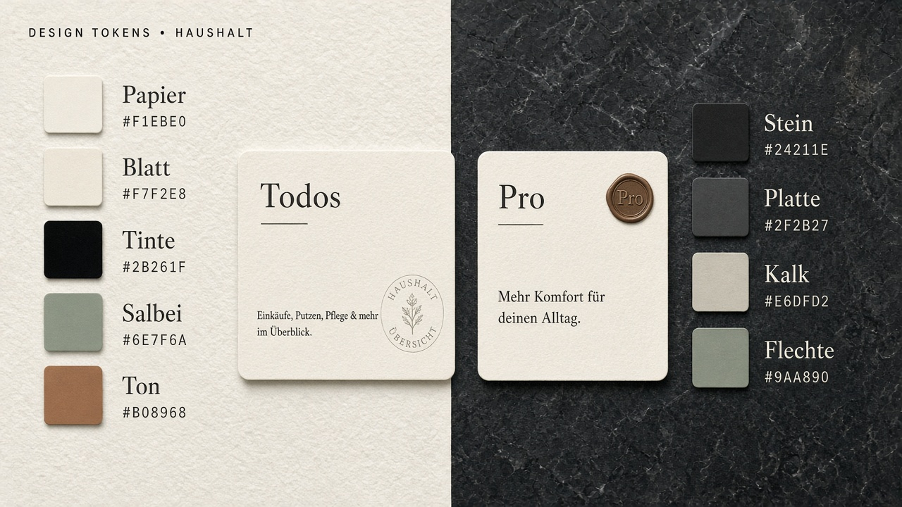
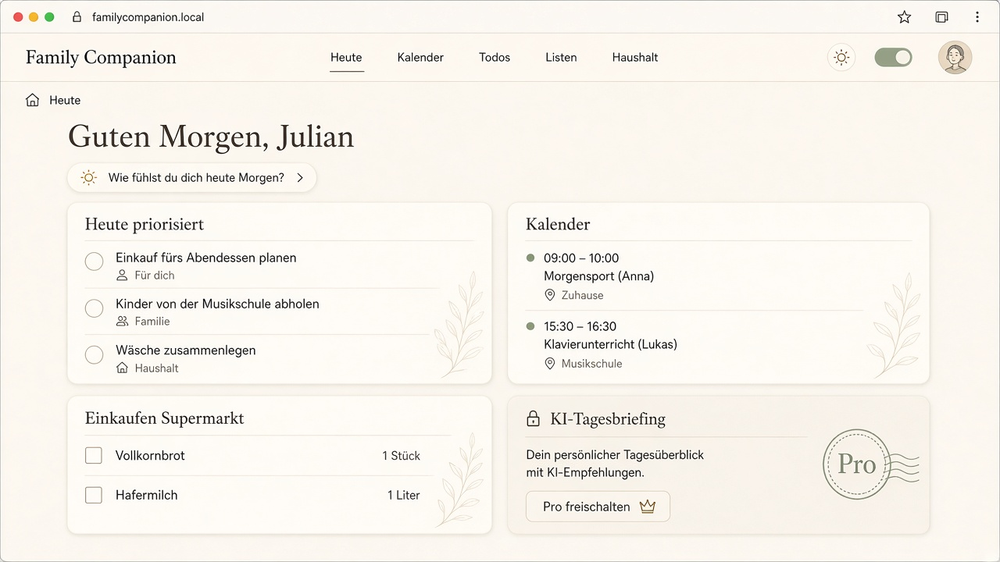
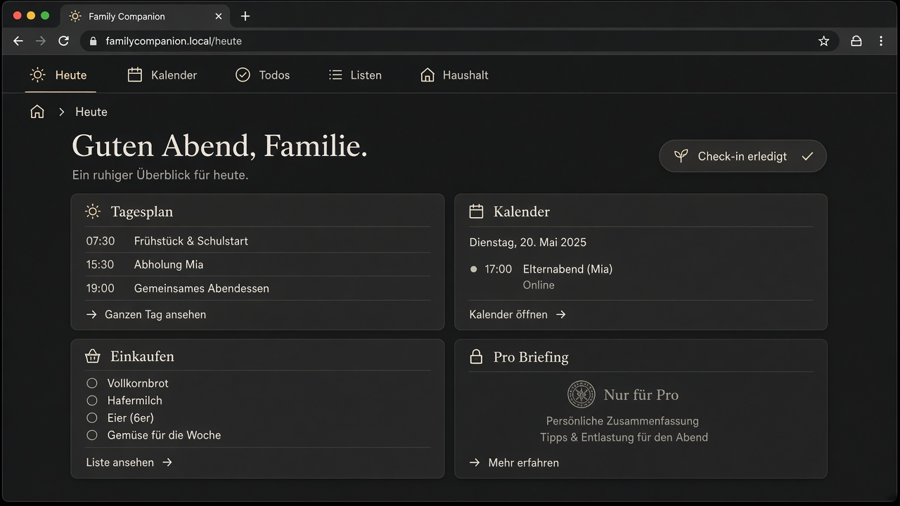
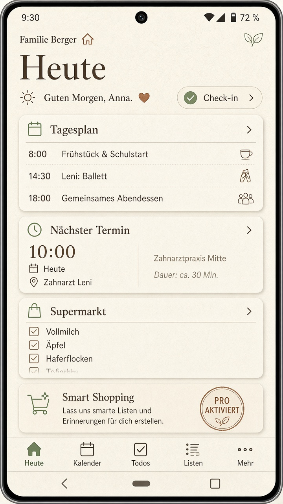
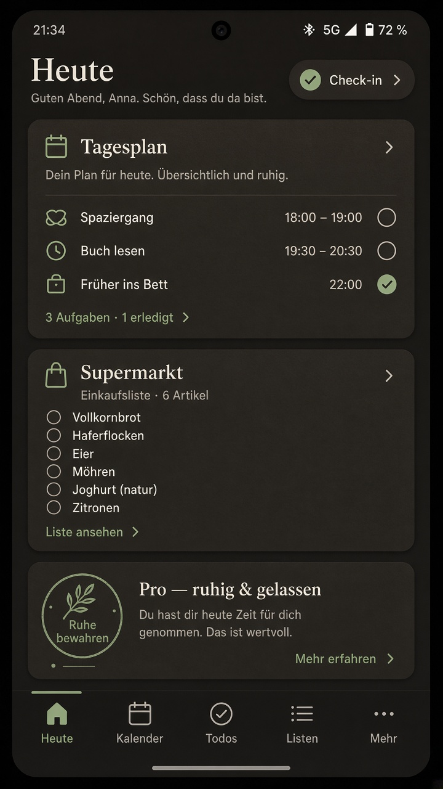

# UI / UX — Family Companion

Lebendige Form- und Farbvorlage für Web und Android. Beide Flächen teilen dieselbe Sprache; Web darf ausführlicher sein, die App bleibt tab-schnell.

Wireframe-Bilder: [preview.html](./preview.html) (Tokens live) · [tokens](./design-tokens-board.png)

## Haltung

Ruhe vor Lautstärke. Die Oberfläche soll sich anfühlen wie ein Küchentisch am Morgen: Papier oder Stein, nicht ein SaaS-Dashboard.

- **Kein Sidebar.** Weder Web noch App.
- **Eine Informationsarchitektur.** Dieselben fünf Orte, nur die Chrome unterscheidet sich.
- **Karten ohne linken Farbstreifen.** Das ist das Klischee, das wir vermeiden.
- Light = **Art Paper**, Dark = **Stone**.

---

## Orte (gemeinsam)

| Ort | Web | App |
| --- | --- | --- |
| **Heute** | Dashboard, Check-in, priorisierter Tag | Tab *Heute* |
| **Kalender** | Woche/Monat, Detail | Tab *Kalender* |
| **Todos** | Liste + Filter | Tab *Todos* |
| **Listen** | Themen (Supermarkt, …) | Tab *Listen* |
| **Haushalt** | Mitglieder **mit E-Mail**, Entfernen/Austreten, Einladungs-Überblick, Link zur Invite-Verwaltung | Tab *Mehr* |

Web-Chrome: schmale **Top-Leiste** (Wortmarke, die fünf Orte, Theme, Avatar) plus **Breadcrumbs**.  
App-Chrome: **Title** oben, **Tabs** unten. Kein Hamburger.

Breadcrumbs bilden denselben Stack wie die App-Routes, z. B.:

```text
Heute
Listen / Supermarkt
Haushalt / Mitglieder
Haushalt / Einladen
```

So bleibt Web nah am Mobile-Routing, ohne eine zweite Navigationsmetapher.

---

## Farbe

Wenige Töne, alle warm-stumpf. Akzent ist Salbei, nicht Petrol und nicht Lila. Ton/Clay nur für Pro-Siegel und mittlere Energie.

### Light — Art Paper

| Token | Hex | Rolle |
| --- | --- | --- |
| `paper` | `#F1EBE0` | Fläche |
| `sheet` | `#F7F2E8` | Karte, Top-Bar |
| `well` | `#E6DFD2` | vertieft (Chips, Tab-Bar) |
| `ink` | `#2B261F` | Text |
| `ink-soft` | `#5E574C` | Sekundär |
| `ink-faint` | `#8A8274` | Meta, Breadcrumb |
| `rule` | `#D3C9B8` | Haarlinie |
| `sage` | `#6E7F6A` | Fokus, erledigt-ruhig |
| `sage-wash` | `#E3E6D8` | sanfte Fläche |
| `clay` | `#B08968` | Pro-Siegel, Energie mittel |
| `rust` | `#9A5B4A` | Fehler, nie knallrot |

### Dark — Stone

| Token | Hex | Rolle |
| --- | --- | --- |
| `stone` | `#24211E` | Fläche |
| `slab` | `#2F2B27` | Karte, Top-Bar |
| `cave` | `#1A1816` | vertieft |
| `chalk` | `#E6DFD2` | Text |
| `chalk-soft` | `#B2A99A` | Sekundär |
| `chalk-faint` | `#7A7368` | Meta |
| `vein` | `#454039` | Haarlinie |
| `lichen` | `#9AA890` | Fokus |
| `lichen-wash` | `#3A3F36` | sanfte Fläche |
| `sand` | `#C4A27A` | Pro-Siegel |
| `terracotta` | `#C48978` | Fehler |



---

## Form

| Maß | Wert | Warum |
| --- | --- | --- |
| Kartenradius | `20px` | weicher als Material-8, nicht Blob |
| Button / Chip | `999px` oder `12px` | Chips pill, Buttons leicht gerundet |
| Haarlinie | `1px` `rule` / `vein` | statt Schattenwänden |
| Schatten Light | `0 12px 32px -16px rgb(43 38 31 / 18%)` | Papier hebt sich |
| Schatten Dark | `0 12px 28px -14px rgb(0 0 0 / 45%)` | Steinplatte |
| Innenkante | `inset 0 1px 0 rgb(255 255 255 / 40%)` (Light) | Blattglanz, kein Gradient-SaaS |
| Raster | 8 · 16 · 24 · 40 | Web-Inhalt max. ~1080px, zentriert |
| Formularstapel | max. 12px zwischen den Feldern | nur `gap`, kein Extra-Margin am `.field` |
| Titel | serif, Georgia / Iowan / `Source Serif 4` | editorial, nicht Inter-everywhere |
| UI-Text | humanist sans, `Source Sans 3` oder System-UI | lesbar auf dem Handy |

---

## Karten

**Nicht:** linker Balken, lila Gradient, 3-D-Clay, knallige Badges.

**Stattdessen:**

1. Fläche `sheet` / `slab`, Radius 20.
2. Kurze **Haarlinie unter dem Titel** (nicht über die ganze Karte).
3. Meta oben rechts als kleiner **Stempel** (`Heute`, `2 offen`, `Pro`).
4. Optional: sehr blasses Zeichen (Kalender, Liste) in der Ecke, ~6 % Deckkraft.
5. Free-Karten sind voll lesbar. Pro-Karten bleiben lesbar, liegen aber unter einem leichten Milchglas und tragen ein ruhiges Siegel — nicht ausgegraut-tot.

```text
┌─────────────────────────────────────────┐
│  Tagesplan                    3 offen   │  ← Stempel, kein Badge-Bonbon
│  ────────                               │  ← kurze Linie
│                                         │
│  Auto sauber          heute · Julian    │
│  Milch, Brot          Supermarkt        │
│  Fitness              18:00 · beide     │
└─────────────────────────────────────────┘
```

Pro-Karte: derselbe Körper, Siegel `Pro` in Clay/Sand, ein Satz warum es wartet. Kein Schloss-Emoji-Teppich.

---

## Icons (Phase 2.1)

Eine Icon-Sprache für Bereiche und Item-Typen — **dieselben Icons** in App-Tabs, Web-Nav und Heute-Cards.

| Bereich | Key (Shared) | Verwendung |
| --- | --- | --- |
| Heute | `heute` | Tab, Nav, ggf. Gruß-Bereich |
| Kalender | `kalender` | Tab, Nav, Termin-Cards |
| Todos | `todos` | Tab, Nav, Todo-Cards |
| Listen | `listen` | Tab, Nav, Einkauf-Cards |
| Haushalt / Mehr | `haushalt` | Nav, Tab *Mehr* |

Item-Typen auf dem Tagesplan: `event`, `todo`, `shopping` (+ optional Kategorie-Icon für Listen-Themen).

- Keys und Labels in `@family-companion/shared`; Rendering Web (SVG) und App (Vector Icons) getrennt, gleiche Semantik.
- Keine Emoji als Ersatz für Navigation.

## Energie-Hinweis (Anzeige, Phase 2.1)

`energyHint` auf Heute-Cards als **gedämpfte Ampel** — scanbar, aber zur Haltung passend:

| Stufe | Token (Light) | Token (Dark) |
| --- | --- | --- |
| `low` | `sage` | `lichen` |
| `medium` | `clay` | `sand` |
| `high` | `rust` (sparsam) | `terracotta` (sparsam) |

Immer zusätzlich Kurzlabel oder `aria-label` („Energie: niedrig“) — nicht nur Farbe.

---

## Heute-Dashboard (Phase 2.1) — umgesetzt

Nach User-Test und [02.1-heute-ux.md](../phasen/02.1-heute-ux.md):

1. **Gruß** + Check-in-Formular *oder* **Check-in-Chip** (eigene + Partner-Stimmung/Energie)
2. **Vorschläge** (wenn Algo welche liefert) — eigene Card, Bestätigen/Ablehnen
3. **Tagesplan** — priorisierte **Mini-Cards** (nicht flache Liste); Typ-Icon, Energie-Signal, Meta als Stempel
4. **Einkauf** auf dem Tagesplan: nur **Kategorie + Anzahl offen** (z. B. „Supermarkt · 3 offen“), keine Produktnamen
5. **Summary-Cards** (Web Raster, App Spalte): Kalender, Listen, Todos — je eine Zeile + Tap zum Tab

Heute bleibt primär **Überblick**; Abhaken auf Heute für Events/Todos umgesetzt (Issue #20). Einkauf: Tap-through zu Listen. Detail-CRUD in den Tabs.

---

## Kalender (Phase 2.2)

[02.2-kalender-todos-ux.md](../phasen/02.2-kalender-todos-ux.md)

### EventCard / TodoCard (T1)

Gemeinsame Card-Sprache für Kalender- und Todo-Listen. Shared-Helfer: `eventCardPills`, `todoCardPills`, `assigneeCountDisplay` in `@family-companion/shared`.

| Prop | EventCard | TodoCard |
| --- | --- | --- |
| `event` / `todo` | `CalendarEvent` | `TodoItem` |
| `household` | `Household` | `Household` |
| `actorId` | aktuelle User-ID (Zuweisung fett wenn dabei) | aktuelle User-ID |
| `done?` | erledigt-Stempel, durchgestrichener Titel | erledigt-Stempel, durchgestrichener Titel |
| `onPress?` | öffnet View-Modal (#23 / #27) | öffnet View-Modal |
| `onToggleDone?` | — (Kalender: kein Abhaken in der Liste) | Checkbox/Switch auf der Card |
| `toggling?` | — | deaktiviert Toggle während Save |

Meta als **Pills** unter dem Titel (Form: `pill` / `soft` / `tag` je Typ). Typ-Icon + `EnergyHintBadge` wie Heute. Zuweisung: **Anzahl Personen** (`1 Person` / `n Personen`), fett wenn Actor in `assignedTo` oder leer (= Haushalt).

Web: `apps/web/components/cards/` · Mobile: `apps/mobile/components/cards/`

- **Wochenansicht:** KW-Header mit Vor/Zurück; Termine pro Tag als **EventCards** (nicht Endlosliste).
- **Liste:** keine Checkbox, keine Text-Buttons — Tap öffnet **View-Modal**.
- **View-Modal:** Infos ausführlich (Pills), **Erledigt**-Chip, Bearbeiten/Löschen (Löschen `rust`).
- **Habits** (`kind: habit`) bleiben im Kalender — Haushalt sieht gegenseitig den Plan.
- **Neu:** Plus-Icon (Web oben rechts in der Card, Mobile FAB unten rechts) → Add-Modal mit Chip-Selectors.
- Zuweisung in der Card: **Anzahl** Personen (fett wenn du dabei); Namen später.

## Todos (Phase 2.2)

- **TodoCards** wie EventCards (Pills, Energie, Icons).
- **Abhaken:** Checkbox auf der Card erlaubt; zusätzlich im View-Modal.
- Add/Edit: Modal + Chips, Plus-FAB wie Kalender.
- Todo-Habits: Aufgaben ohne festen Kalender-Slot; Kalender-Habits: zeitgebunden in der KW.

## Listen (Phase 2.3)

[02.3-listen-ux.md](../phasen/02.3-listen-ux.md)

- **Tabs:** Chip-Reihe = haushaltsspezifische Listen; kein „Alle“-Tab.
- **Neue Liste:** Plus oben rechts in der Card → Modal.
- **Artikel:** Hinzufügen unter den Chips — ein Textfeld, ✓/✗ rechts; Kategorie = aktiver Tab.
- **Zeile:** Checkbox + Name; Löschen-Icon rechts nur bei Fokus; keine Meta-Zeile.
- **Kategorie:** Long-Press (App) / Rechtsklick (Web) auf Listen-Chip → Bearbeiten / Löschen
- **Autocomplete:** ab 3 Zeichen, Teilmatch auf frühere Artikelnamen.

## Haushalt & Shell (Phase 2.4)

[02.4-haushalt-nav-shell.md](../phasen/02.4-haushalt-nav-shell.md)

- **Mitglieder:** MemberRow (E-Mail, Rolle-Pill); Inhaber „Entfernen“ (`rust`).
- **Web-Chrome:** Check-in-Chip (Morgen-Snapshot) in Top-Leiste.
- **Mobile:** Zahnrad auf Heute → Einstellungen; Check-in-Chip oben auf Heute (#16).
- **Settings:** Theme, Konto, Abmelden, Pro-Platzhalter.
- **Legal:** Footer Web → Impressum/Datenschutz.

## Landing (Phase 2.5)

Öffentliches `/` mit Hero, drei Feature-Karten (Listen, Kalender & Todos, Heute) und auth-abhängigen CTAs. Route-Gruppen `(marketing)` vs `(app)`; App-Chrome nur in `(app)`. Tokens wie die App — kein separates Marketing-Theme. Details: [02.5-landing-scaffold.md](../phasen/02.5-landing-scaffold.md). Finales Visual und SEO **später**.

---

## Dashboard

Pflicht für *Heute*, sobald der Morgen-Check-in da ist (sonst nur Check-in-Karte).

Web (ausführlicher):

- Gruß + Check-in-Chip (Stimmung / Energie, beide Personen wenn da)
- Kartenraster 2×2: Priorisierter Tag, Kalender, offene Liste, Pro-Hinweis
- Keine Widget-Dichte wie eine Analytics-Suite

App (derselbe Inhalt, eine Spalte):

- Gruß + Chip
- 2–3 Karten, dann Schluss
- Rest lebt in den Tabs

---

## Wireframes

### Web — Heute (Art Paper / Stone)





```text
┌ top: Family Companion    Heute  Kalender  Todos  Listen  Haushalt   ☽  ● ┐
├ breadcrumb: Heute                                                    ┤
│                                                                      │
│  Guten Morgen, Julian          [ Check-in · Sophie 3 / Julian 4 ]    │
│                                                                      │
│  ┌ Tagesplan ─┐  ┌ Kalender ─┐  ┌ Supermarkt ─┐  ┌ Pro-Briefing ─┐  │
│  │ …          │  │ …         │  │ …           │  │ Siegel Pro    │  │
│  └────────────┘  └───────────┘  └─────────────┘  └───────────────┘  │
└──────────────────────────────────────────────────────────────────────┘
```

### App — Heute (Art Paper / Stone)





```text
┌ Haushalt · Unser Haushalt          ┐
│ Heute                              │
│ Guten Morgen                       │
│ [ Check-in ]                       │
│ ┌ Tagesplan ─────────────┐         │
│ └────────────────────────┘         │
│ ┌ Nächster Termin ───────┐         │
│ └────────────────────────┘         │
│ ┌ Supermarkt ────────────┐         │
│ └────────────────────────┘         │
├ Heute  Kalender  Todos  Listen  Mehr ┤
└────────────────────────────────────┘
```

### Web — Haushalt (Mitglieder)

```text
┌ Haushalt                              Plan free · 2 Mitglieder ┐
│ ────────                                                       │
│  sophie@home.de     Mitglied                                   │
│  julian@home.de     Inhaber · du          [ Austreten ]        │
│  (Owner sieht bei anderen [ Entfernen ])                       │
│                                                                │
│  Offene Einladungen → Einladungen verwalten                    │
└────────────────────────────────────────────────────────────────┘
```

Konto-E-Mail ist die primäre Zeile, Rolle sekundär. Kein nacktes „Mitglied“ als einzige Beschriftung.

---

## Theme

System folgen, manuell überschreibbar (Top-Bar / *Mehr*). Dieselben Token-Namen in CSS und in einer kleinen Shared-Map für Expo (`paper` ↔ `stone` je Mode). Kein zweites Paletten-Set pro Plattform.

---

## Nicht tun

- Sidebar, Drawer als Hauptnavigation
- Linker Akzentstreifen an Karten
- Reines Schwarz / reines Weiß als Fläche
- Sättigung über die Salbei-/Clay-Werte
- Unterschiedliche IA zwischen Web und App

Tokens zum Ausprobieren: [preview.html](./preview.html).
